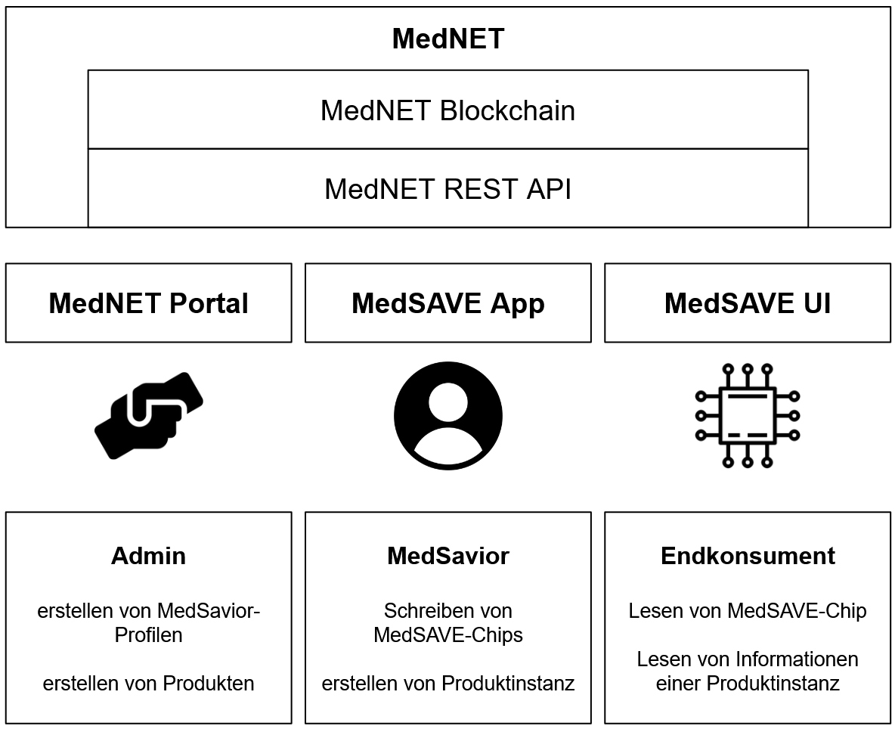
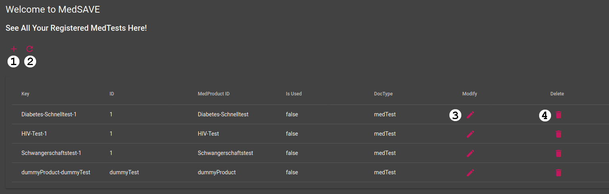
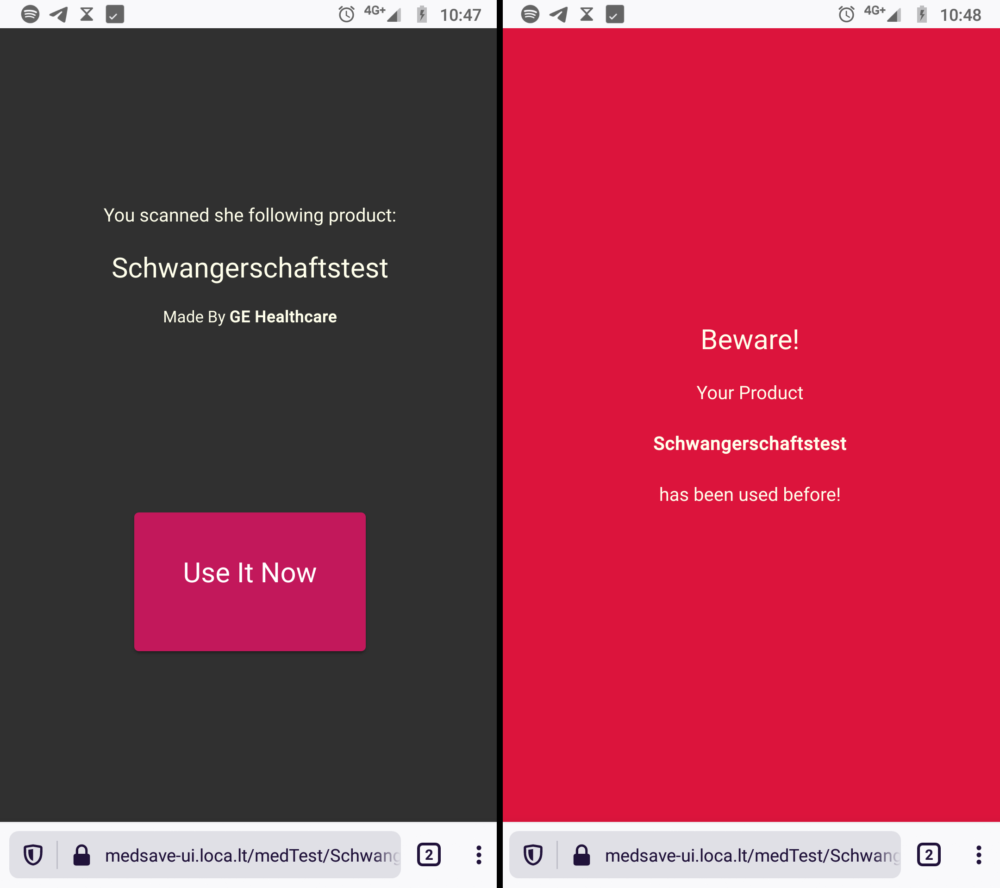

# MedNET: A Blockchain Solution for the Detection of Fraudulent Medical Tests

This application was developed for a *Blockchain Hackathon* held by Leipzig University's *Chair of Application Systems*.
The given task was to develop a blockchain-based application, that allows organisations to fight against forged medical consumer devices.

MedNET is a prototype for detecting fraudulent medical tests for self-diagnosis (MTSD).
Especially in developing countries either fraudulent or already used medical tests are sold to consumers on the black market, which can have serious consequences for them concerning their health and safety.
The application allows permitted organisations to associate each produced unit of a MTSD with a digital represetation in a blockchain.
Each produced unit is then provided with a NFC-chip that can be scanned by the consumer, to authenticate a product and to check wether it was already used or not.


## 1. Project Structure

<p align="center">
  
</p>

The project consists of the following components:

- MedNET
- MedNET-CRUD UI
- MedSAVE UI

The underlying concept is to create the *MedNET*, a blockchain and a REST-API, so permitted organisations can create MedSavior-profiles for their co-workers and define the model for their MTSD via the *MedNET Portal*.
Users with a MedSavior-profile shall then be able to create product instances by using the *MedSAVE App*, and write their URL on an MedSAVE-chip (NFC).
Afterwards, this chip is put on the packing as a seal.
When consumers receives the MTSD, they can use the *MedSAVE UI* to scan the packing with their smartphone and to verify the authenticity by comparing the provided product information with the packing.
An additional feature is to mark the MTSD as used.

This project consists of a prototype of the MedNET, the MedNET portal, and the MedSAVE UI.

### 1.1. MedNET

This component consists of an implementation of the Hyperledger Fabric Blockchain v2.2 and a Node.js Express backend.


#### 1.1.1. Blockchain
The project's underlying blockchain was forked from [Hyperledger Fabric repository](https://github.com/hyperledger/fabric) on January 22nd 2021.
Hyperledger Fabric is an "open source enterprise-grade permissioned distributed ledger technology (DLT)" [[1]](https://hyperledger-fabric.readthedocs.io/en/latest/whatis.html#hyperledger-fabric), that provides an architecture to build a permissioned blockchain.

The implemented blockchain includes one **orderer organisation**, two **peer organisations**, one **channel** associated with a **chain code** (Smart Contract).
Each organisation has one certification authority.
The chain code is implemented in JavaScript and allows CRUD-operations for an instance of the entity *MedTest*.

A MedTest has the following properties:

```javascript
struct MedTest 
{
  key: string,
  id: string,
  medProductId: string,
  isUsed: boolean,
  docType = 'medTest'
}
```

The blockchain allows permitted organisations to create, read, update, and delete only their own tests.

#### 1.1.2. Backend

By using the backend, permitted organisations can execute these CRUD operations via HTTPS.
The endpoint ``/api/medTests`` allows fetching all created tests via a GET operation and the endpoint ``/api/medTest/:key`` allows creating, updating, fetching, and deleting a MedTest with its respective key.
Each access to MedTests through this backend are logged as a transaction in the blockchain.

### 1.2. MedNET Admin

MedNET Admin is a dashboard that accesses the MedNET REST API and allows admins in organisations to list all their available MedTests, and to create, delete and update individual instances.

<p align="center">
  
</p>

The provided functions are:


(1) create a new test,

(2) update the view,

(3) modify a MedTest instance,

(4) delete a MedTest instace.

### 1.3. MedSAVE UI

<p align="center">
  
</p>

The MedSAVE UI is a web page that accesses the MedNET REST API.
After scanning a MedSAVE-chip, consumers are redirected to this web page that displays information about a MedTest unit.
In addition consumers can mark a MTDS as used, by pressing the provided button.
If the test isn't marked as used, the consumer sees a page similar to the left hand side of the image.
If it **is** marked as used, the consumer is redirected to the page like on the right hand side.


## 2. Setup project

The following instructions are executed on an 64-bit Ubuntu 20 LTS.
Pre-requisits:
In order to execute the following bash script successfully you need to install the following programs
- git
- docker
- docker-compose

Make sure the current user can run docker by running this command:

```bash
docker run hello-world
```

If you have no permission to run this command, although docker is installed, follow the instructions [here](https://docs.docker.com/engine/install/linux-postinstall/).

***NOTE:***
the containing bash scripts expose the MedNET-backend and the MedSAVE UI via ngrok.

Checkout this project:
```bash
git clone https://github.com/locojoetive/mednet.git
````

Enter the project folder:
```bash
cd mednet
```

Execute the following bash script:
```bash
./0_start_bc_and_be.sh
```
